# **当代资本主义社会从何而来？又将向何而去？**

<h4 style="text-align: right">

*控制论视角下的当代资本主义*

</h4>

---

# 1. 赛博朋克：Cyberpunk

<!-- 
随着电子游戏赛博朋克2077的发售，赛博朋克这一文化符号在互联网又掀起了一波讨论的浪潮。

然而，如今大量的人们仍然停留在赛博朋克作为一种五光十色的文化符号和美学表征的认知，
抑或是是浅尝辄止地将赛博朋克视为某种纯粹的未来幻想或者文学题材，而无意识地削弱了这个题材的现实性和历史性，消解了其带来的尖锐性。

而我们此次的报告，就将以赛博朋克为切入点，带大家从一种全新的视角来看待当代社会，尤其是当代资本主义社会。 
-->

---

# 1. 赛博朋克：Cyberpunk

#### 解构与重建构

- Cyberpunk: 对控制论的反叛和反抗

  - Cybernetics: 控制论，跨学科研究，用于研究控制系统
  
  - Punk: 朋克，一种反叛、反体制的态度

<!-- 
首先让我们从词源上对 Cyberpunk 这一概念进行解构与重新建构。

Cyberpunk 是“控制论”（cybernetics）与“朋克”（punk）的结合词。

Cyber 在如今常常被指向另一个概念，网络技术。也基于此衍生出 Cyber Security（网络安全），Cyber Space（网络空间）等概念。
但是事实上计算机网络技术最多只能算作 Cybernetics 的子集，而非双向映射。

朋克（Punk）一词最早是指一种摇滚的音乐风格，后来逐渐演变为一种文化现象，代表着一种反叛、反体制的态度。

二者相结合我们便可知一个相对精确的 Cyberpunk 概念，一种对控制论的反叛和反抗。

而脱离词源，直接观察催生了 Cyberpunk 概念的一系列文学和娱乐作品，显而易见的，Cybernetics 是作为一种社会的形态而被批判与反抗。

而由于所有赛博朋克作品压倒性的西方意识形态语境，我们几乎可以做一种断言：Cyberpunk 反抗的是一种基于控制论运行的资本主义社会。 
-->

---

# 2. 什么是控制论资本主义？

以控制论为社会运作本体论和认识论的资本主义

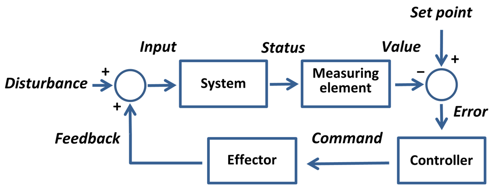

<!-- 

那么，什么是控制论资本主义呢？它又从何而来？

简单来说，控制论资本主义就是以控制论为社会运作本体论和认识论的资本主义。

站在资本主义认识论的角度来说，此概念的诞生来自马克思研究学者们对于全球资本主义在当今技术革命影响下发生的内部转型的一种表述需求。

学界其实对于这个需求做出了多次的尝试：算法资本主义、认知资本主义、交往资本主义、数据资本主义、数字资本主义、非摩擦资本主义、信息资本主义、平台资本主义、符号资本主义、监控资本主义、虚拟资本主义，等等。这些其实就暗示我们传统的资本主义概念可能不足以涵盖当前复杂的现象。

例如，谷歌对数据的垄断和依赖广告收入的模式，既不同于传统的生产性剥削，也不同于经典的智力垄断或封建食利者模式。

而老师上课时所举例的 CEO 与炒股工人的阶级模糊性，也是这种复杂性的体现。

而控制论资本主义这个概念范式就是冲着解决这个棘手问题而来的。

 -->

---

# 4. 控制论资本主义的演化历史

 

- **控制论与新自由主义**

- **信息技术革命**

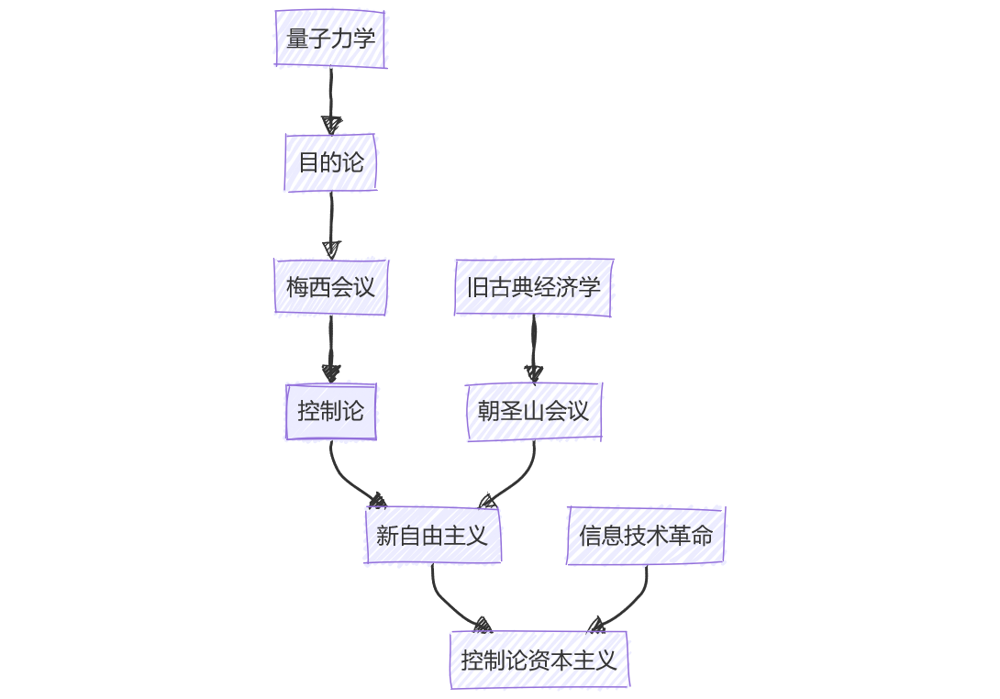

<!-- 

如果说当代的资本主义是一种控制论为认识论的资本主义，那么从本体论的角度来看控制论资本主义社会又是如何形成的呢？以及，以控制论资本主义具体而言又是何物？

要解答这些问题，我们认为首先了解两段历史是最好的开头，一段是关于控制论的历史，另一段是关于新自由主义的历史

-->

---

# 4. 控制论资本主义的演化历史

**维纳**于 1948 年出版：

《控制论: 或关于动物与机器的控制和通信的科学》
- 信息的流动
- 系统的目的
- 反馈调节

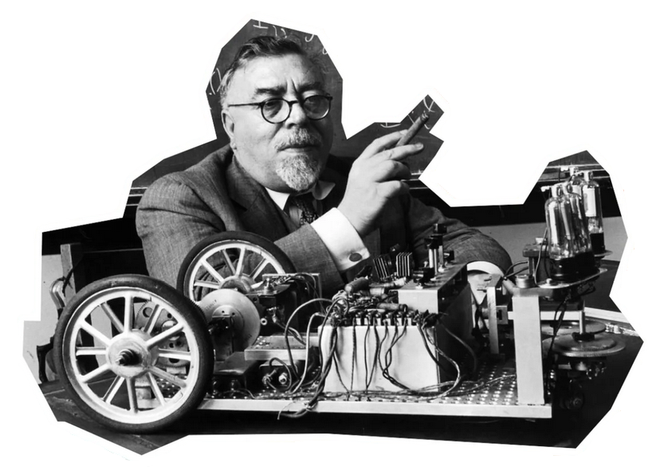

<!-- 
首先要说的是，最初正式赋予「控制论」一词现代概念的，是维纳在1948年出版的《控制论》一书。

在维纳的理论中，控制论系统通过各个组成部分的信息流动和反馈，不断调整自身的运行方式，完成系统的自我调节和自我控制，从而形成无需外部规划和干预的自发秩序。

这本书的副标题「或关于动物与机器的控制和通信的科学」（or Control and Communication in the Animal and the Machine）也说明了一个目的。
用最简单的话来概括，维纳想要提出一种研究机器、生命和社会中控制和通讯的一般规律的科学。

万物之生，皆有其来，控制论也是如此，接下来我们来介绍一下控制论的历史。
 -->

---

## 4.1 控制论历史

 

### 4.1.1 量子力学：破碎的决定论

1927年，玻尔和海森堡一起提出了量子力学的哥本哈根诠释：
- 物理仅仅是现实的认知论，而现实的本体被放弃解释。
- 不仅无法完全获知现实的状态，也无法预测未来的状态。

<!-- 
1927年，玻尔和海森堡一起提出了量子力学的哥本哈根诠释，这一理论指导人类如何看待量子力学中种种光怪陆离的现象。

其中包含有两条极具破坏性的信息：

第一，一个量子系统的量子态可以用波函数来完全地表述。
波函数代表一个观察者对于量子系统所知道的全部信息。
波函数除了抽象的概念以外，没有任何真实的存在。
它杀死了我们的物理本体论（也被称为物理的实在论），物理仅仅成为了现实的认知论，而现实的本体被放弃解释。

第二，量子系统的描述是概率性的，同时，在量子系统里，一个粒子的位置和动量无法同时被确定。
这杀死了我们的物理决定论（也称为物理的因果论），我们不仅无法完全获知现实的全部状态，我们也无法基于系统的现有状态来预测未来的状态。
 -->

---

## 4.1 控制论历史
### 4.1.2 目的论与反馈

毕格罗，维纳，罗森布曾斯（图同序）共同于 1943 年发表:

《行为、目的和目的论》

- 决定论：因为饿了，所以去吃饭
- 目的论：为了吃饱，所以去吃饭

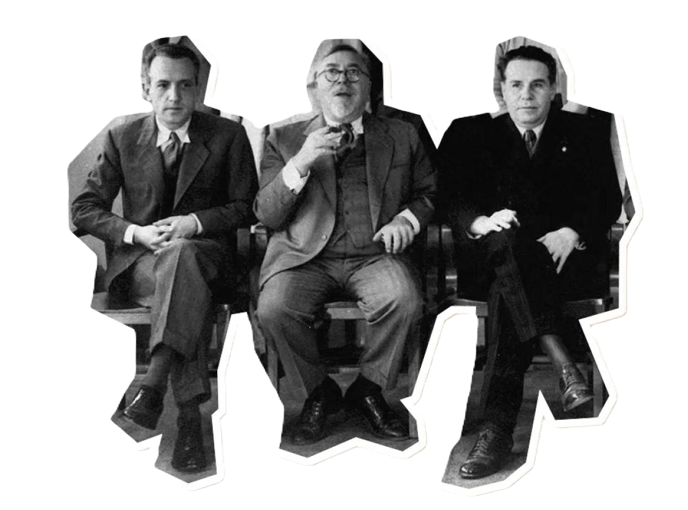

<!-- 
《行为、目的和目的论》（Behavior，Purpose and Teleology），由维纳，他的学生和一位神经医学家共同于1943年发表在《科学哲学》刊物上。

其中的核心观念目的论，是和决定论相对立的一种科学观，虽然他在论文中强调不想和决定论打架，但是在我们接受哥本哈根诠释之时，决定论已经死了。

在传统机械决定论的角度来看，各位是因为饿了，所以去吃饭；而在目的论的角度来看，各位是为了让自己吃饱，所以去吃饭。

目的论的冲击点在于，未来会发生的事情决定了当下的行动。这是一种非常激进的因果循环论。

-->
---

## 4.1 控制论历史
### 4.1.2 目的论与反馈

《行为、目的和目的论》

- 负反馈使得系统的输出不超出目标
- 为了吃饱，需要把一些事情搁置

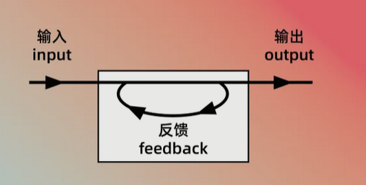

<!-- 

赋予反馈以现代概念，是这篇文章第二个控制论奠基点，所有「有目的的行为」都可以被认为是需要负反馈的，来自于目的的信号被用于限制输出，使输出不超出目标。

也就是说为了能吃饱饭，我们需要把一些手头的事情搁置，去吃饭。你经过反馈之后的停止工作行为，就是经过负反馈之后的输出。

-->

---
## 4.1 控制论历史
### 4.1.3 梅西会议：跨学科的理论

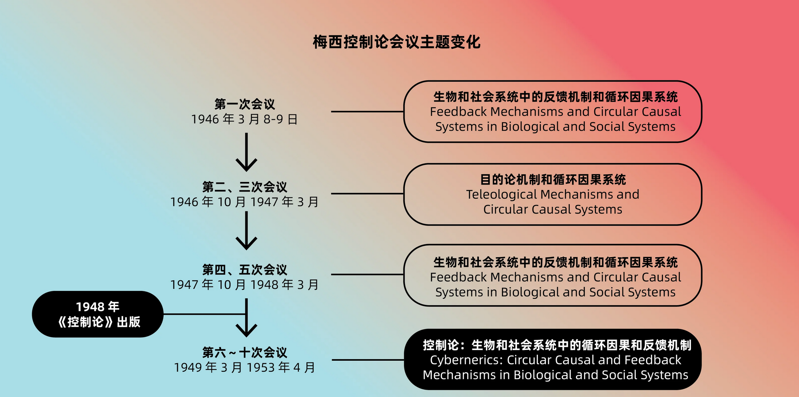

<!-- 
《行为、目的和目的论》在1943年正式发表前，曾在1942年的一次梅西会议上被宣读，维纳本人没有出场。
而这个梅西会议就是控制论最终成型的重要时空节点。

梅西会议由梅西基金会（Josiah Macy, Jr. Foundation）赞助，起初是纯医学领域的交流会议。

不过后来演变成了跨学科研讨会，现在说的梅西会议一般是指1946年-1953年的十次跨学科讨论会，就是在这十次会议上，控制论在讨论中成型。

也正式由于多次的跨学科地讨论控制论，这帮人隐隐形成了一种控制论的新现实本体论意识，也就是现实中的一切，均为控制系统。

也许我不提，许多同学并不会感受到这种控制论的现实本体论的冲击，所以请同学们重新思考一下：如果将人类社会、生物体和自动化机器都看作一个控制系统，那么它们就不存在本质区别。

也就是说，人类和机器，并没有本质区别，人类可以被机器化，而机器也能够被生命化。

如果我们回顾现代生命科学和人工智能两门学科的快速发展就会发现，这个观点事实上是这两门学科的底层基础。
 -->

---
## 4.1 控制论历史
### 4.1.4 新生的控制论

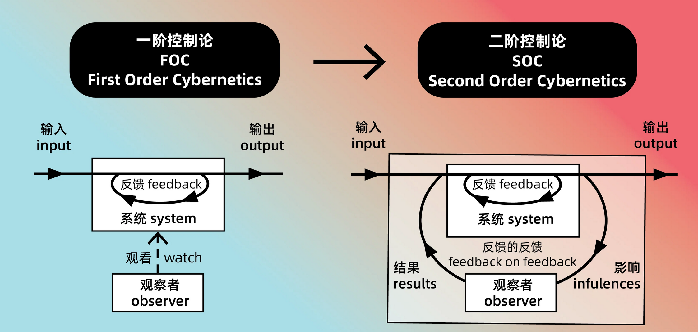

<!-- 

在维纳正式提出控制论之后不久，其在工程技术方面的实际运用起于钱学森同志的《工程控制论》，它在工程和技术方面使如此有用，以至于人们直接独立了一个控制原理（ Control Theory ）的分支。

而作为系统科学，控制论也从最初的一阶控制论，逐渐发展到二阶控制论，再到自创生理论，被不断完善，虽然这些也使控制论的重要历史，但是到此为止介绍的控制论已经足以让我们理解控制论资本主义。

我们就不再展开。

 -->

---

# 4. 控制论资本主义的演化历史
## 4.2 新自由主义历史

新自由主义

- 以市场为经济的本体
- 自由贸易，全球化，减少政府干预

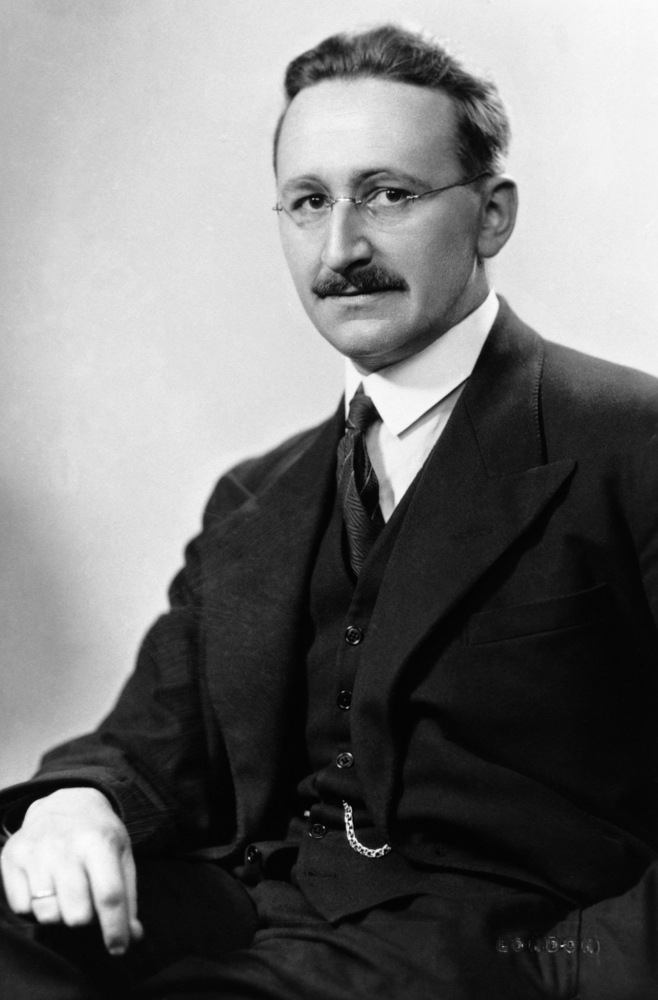

<!-- 
而新自由主义，从其正式诞生的历史来看，可以说一直就是一个控制论项目。

简单而言，新自由主义以市场为经济的本体。

所以他们所有的政治诉求就约等于自由贸易，越自由越好，包括但不限于别搞贸易保护，大力推进全球化，减少政府干预等等“自由”政策。

我们可以轻松的发现，现代资本主义已经大量接受了新自由主义，全球化和自由贸易已经融入了我们的意识形态之中。
 -->

---

## 4.2 新自由主义历史
### 4.2.1 朝圣山学社：看得见的手

1947年，39 位学者在哈耶克的召集下在瑞士朝圣山集会：
- 古典自由主义的命运
- 应对马克思主义者和凯恩斯主义者横扫全球的局面

<!-- 
1947年，就在维纳等人汇集最终凝结为控制论科学的思想时，包括哈耶克在内的一群新自由主义知识分子召开了朝圣山学社（MPS）的首次会议。

 -->

---

## 4.2 新自由主义历史
### 4.2.1 朝圣山学社：看得见的手

哈耶克带来了《知识在社会中的运用》
- 社会是一个分布式信息系统
- 市场是一个信息处理器

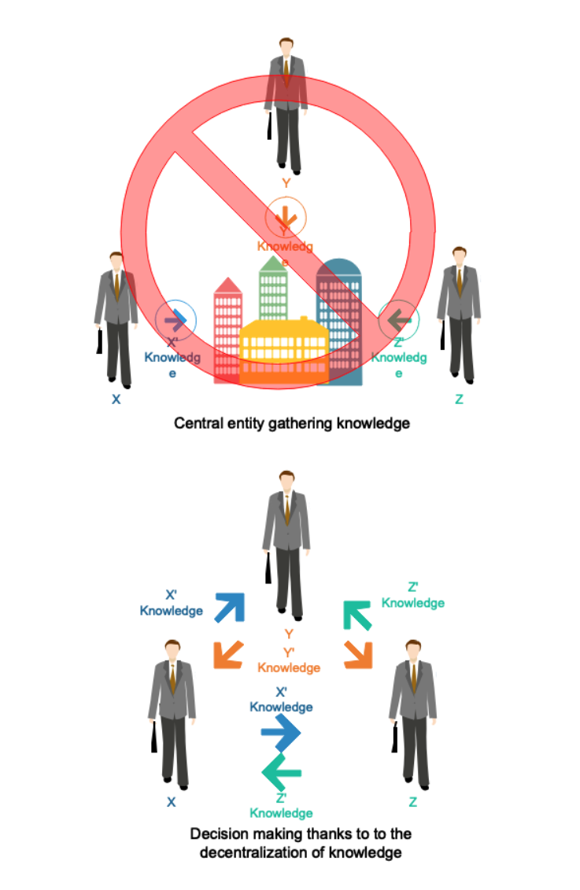

<!-- 

而在这场会议上，哈耶克带来了他的《知识在社会中的运用》（The Use of Knowledge in Society），这篇文章被认为是新自由主义的理论基础。

最初，哈耶克尝试介入社会主义的计算辩论中，即中央计划者能否合理分配资源，哈耶克对这一辩论的介入引入了控制论主题，将其重新构想为一个信息问题。

哈耶克将社会概念化为一个分布式信息系统，中央计划者无法希望理解它，因为他们无法获取所有相关信息，而只有市场才能正确计算分布在社会中的信息。

在发展这一论点时，哈耶克把市场作为一个巨大的计算机，一个信息处理器，传递每个个体理性行动所需的可用信息；此系统的预期目标便是将价格控制在真实的价格供需曲线的那一个交点。

总结来说，哈耶克使用了信息作为社会的本体论，而当这种本体论被确立，控制论作为信息系统的认知论，自然而然成为了社会的认知论。

而当这种本体论和认知论被揭示， 他们的政策就变得不是那么的形而上学，市场的那只看不见的手，被看见了，既然社会是一个信息系统，市场是一个信息处理器，那么任何人为市场调控行为都是一种噪声，使得信息失真，而全球化则是旨在将提升系统的规模，提升单一系统内的信息量和组件数量。

所以新自由主义学派诞生之时，就已经融入了控制论的思想。

 -->

---

## 4.2 新自由主义历史
### 4.2.2 资本主义社会的新自由主义转型

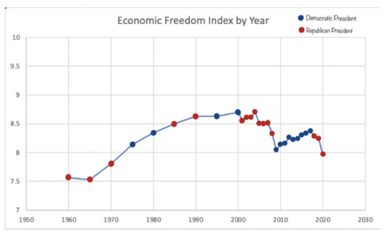

<!-- 

直到 20 世纪 70 年代一系列经济衰退和危机之后，新自由主义政策建议才得到广泛实施。它最开始在许多贫穷国家被实行，尤其是在拉丁美洲国家。 

从 20 世纪 80 年代初开始， 里根政府 和 撒切尔政府 实施了一系列新自由主义经济改革。

随着新自由主义席卷资本主义世界，其裹挟的信息论和控制论意识形态也开始渗透进社会，控制论社会由此逐渐形成。

 -->

---

# 4. 控制论资本主义的演化历史
## 4.3 信息技术革命

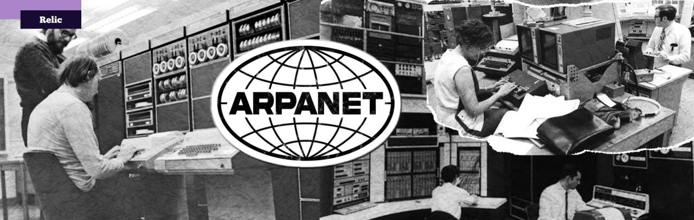

<!-- 

那么在这样的一种信息本体论和认识论的意识形态下，信息技术迅速而压倒性的发展就不足为奇了，信息技术从军工复合体开始，随着控制论的传播，逐渐扩散到政府机构，公司等一系列社会子系统。

我想互联网技术是一个最好的例子，互联网最初是美国军方设计的一个去中心化控制系统。在 1969 年，也就是冷战时期，美国军方想要一种能够在发生核攻击时保留指挥结构的装置。响应将包括一个电子网络，如果几乎所有的通信链路都被破坏，该电子网络能够自动重新控制信息本身，从而允许幸存的当局保持相互通信并做出决定。有了这样的装置，军事权威就可以在最严重的灾难面前得以维持。

我们喜欢说，信息技术革命带来了社会的信息化浪潮，但是各位是否曾经思考过，单纯的信息化，有什么用吗？

就算我们把所有的社会知识和状态，信息化成二进制数据，又怎样呢？

但是当我们知悉这种控制论的认知论后，一切便合理起来，信息化本身并不是目的，我们的目的是控制论。

 -->

---

# 5. 控制论意识形态下的社会

- 市场看得见的手

- 企业生产组织的控制论解决方案

- 信息的流动，反馈，预设的目标

<!-- 

那么当一切终于串起来后，让我们来正式的审视一下当代社会。

信息化浪潮过后，市场得到了具象化，人类的几乎一切交易行为都被数字化并记录下来，

那只市场的手，更加从抽象意义的看见，具象成了当今社会生产背后，被计算机程序实体化的实际规则。

大批控制论的解决方案应用于企业生产组织中：项目管理、公共关系、质量管控等等。

反馈，信息的流动，预设的期望行为，这三个控制论的核心概念被现代社会不断强调和使用，人们对于这些概念已经建立了事实上的默认，这种控制论的意识形态占据了绝对的主导权。

说到这里，我想应该大部分的同学能够认同，我们切实地处在一种控制论社会中，但是对于控制论资本主义，好想还没有特别的明晰，他和传统的资本主义最大的区别是什么？我们虽然提到了很多层面的影响，科学，政治，经济，军事等等，但是它究竟怎么改变了资本主义呢？更确切的来问这个问题，控制论意识形态下，资本的逻辑是什么？ 

-->

---

# 6. 控制论下的资本主义与资本逻辑

- 市场的实体就是被存储的信息

- 市场实体化后，其自然目的被资本篡改

- 信息即利润

<!-- 

当我们在研究一个时代下的资本逻辑，我想大家永远不会否认的一点就是资本的逐利性，资本的一切行为和决策都是为了基于商品交换行为，依托市场来进行货币的大量积累。

而正如我们前面所说，市场和市场的手都已经得到了实体化，那么他们的实体存在于何处？我想答案就是科技公司和金融公司的数据中心。

所以本应流向一个抽象市场的信息，现在都实际流向了现实中的市场实体，而市场实体进行处理之后向外分发信息。

在哈耶克的理论中，抽象市场分发的信息被称为价格信号。

而市场实体分发的信息则不再依赖价格了，我们称之为广告，更具体地说，一个完整的推荐系统将分发这些信息。

在哈耶克理论下的抽象市场，应该反映供需关系，而市场实体的目的却明显是资本的目的，那就是利润最大化。

换而言之，当下的市场在被实体化后，其自然目的被资本篡改为了资本自己的目的。

巨头企业们说自己在市场的公正裁决下自由竞争，胜出的理由是得到消费者的认可，然而他们隐藏了市场已经站在他们这边的事实。

这是一种全新的垄断形式，这种比传统语境下的垄断更加的具有冲击力和破坏性。

而这种市场实体的形成，依赖的是有多少的信息选择在一个实体中流动。越多的信息流入一个市场实体，其分发信息的能力就越强，越能够在市场中占据优势。

因此当代资本逻辑可以总结为一句话那就是：信息即利润。 

-->

---

# 7. 信息殖民化：新的剥削形式

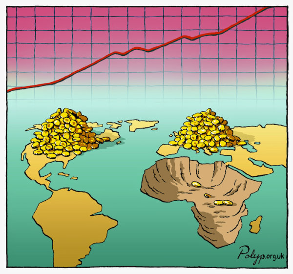

早期资本主义的殖民行为：
- 强迫劳动

- 掠夺资源

- 强行开拓市场

<!-- 

在早期资本主义阶段，殖民行为是资本积累过程中的一个重要环节，主要是由资本积累的需求驱动的。

殖民的主要特征是强迫劳动，掠夺资源，强行开拓市场。

历史告诉我们，在经历一波反殖民浪潮后，殖民似乎已经离我们远去，然而现实真的如此吗？

当信息成为一种财富或者也可以叫做商品，那么我们每一个人作为信息的生产者，难道不就是一种事实上的生产资料吗？

 -->

---

# 7. 信息殖民化：新的剥削形式

当代资本主义的殖民行为：
- 算法实现柔性的规训

- 强制性收集信息

<!-- 

如果我们说资本对于信息的积累已经成为了当代资本积累的重要需求，那么一种新的殖民行为自然而然地诞生了。

这种新型殖民不再依赖暴力，而是通过算法实现柔性的规训;
它获取的不再是有形的原料，而是数字化的信息。

一方面他们利用我们的信息构建基础设施，让我们无法脱离；形成市场实体，操纵我们的需求，另一方面他们接着通过这些基础设施获取我们的信息，利用市场实体来赚取大量的利润。

可以说，资本正在通过数字基础设施，将我们的日常生活殖民化，将我们的越来越多地现实日常纳入新的控制论资本循环当中。

-->

---

# 8. 异化的扩张

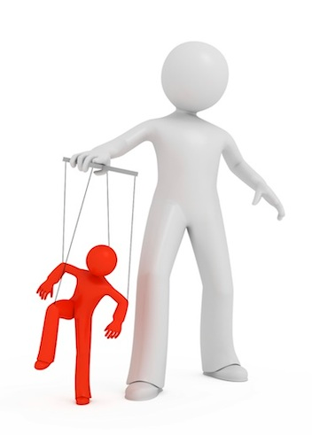

异化：
- 人的存在与他的本质发生偏离。

- 子系统的输出会偏离其自组织时的目的。

- 消费者的目的被迫服务于资本的目的。

<!-- 
对于异化这个概念，从较为哲学的角度来看是人的存在与他的本质发生偏离。

而从控制论的角度来看，异化可以看作：一个控制系统的目的，在成为一个更大的系统的组成部分后，受迫于更大的系统的目的，偏离了其自组织时的目的。

一个控制系统在完全的自组织时，他的输出应该和其预设的目的高度一致。

而当他成为一个更大系统的组成部分后，他的输出则服务于另一件事，那就是让更大系统的输出和目的保持一致，但是作为代价，往往子系统的输出会偏离其自组织时的目的。

只有当一个系统的目的和其组成部分的目的完全一致时，子系统的输出才能在更大系统的控制下保持和他原本目的的一致。

在马克思对资本主义的洞悉中，他认为在资本主义社会，社会中的异化现象达到顶峰，其中最强烈的异化发生在劳动者身上。

但是在控制论资本主义中，异化实际上得到了更大的扩张。

社会对消费者的异化，可以说已经达到甚至超越了对劳动者的异化。

现代经济学的基础假设之一为资源是有限的，因此我们需要找到一种依据来分配社会的资源，当下公认的依据便是所谓的供需关系。

社会主义的计划经济和资本主义的市场经济本质的区别就在于他们判断供需关系的方式不同。

如果市场真实地反应了供需关系，资源配置按照被反映的供需关系，那么社会生产力理应就会被最大化。

但是当我们谈论供需关系和生产力的关联时，我们首先要保证的时供需关系中的需求是人的本质需求、人的自然需求。

马克思指出市场经济下潜在的周期性经济危机，资本生产的目的是利润最大化，而不是满足社会需求，因此会导致生产过剩和资源浪费进而引发经济危机。

而在控制论资本主义中，资本生产的目的依然不变，但是他们利用市场的旧意识形态，和人造的市场实体，已经事实上能够操纵需求。

所有的消费者都在接受着一种针对消费者的需求的异化，消费者的目的被迫服务于资本的目的。
 -->

---

# 9. 控制论资本主义社会，而不是控制论社会

- 反抗控制论资本主义并不等同于反抗控制论本身

- 控制论作为一种研究控制系统的理论和方法，本质是中性的

- 控制论并不阻碍社会生产力最大化

<!-- 

反抗控制论资本主义社会并不等同于反抗控制论本身。正如其他任何科学技术一样，控制论作为一种研究控制系统的理论和方法，尽管它带有强烈的现实本体论预设和反人文主义气息，本质依然是中性的。

在前面讨论异化的小节中，我们提到，当一个更大的控制系统的目的与其子系统的目的不一致时，子系统的输出会偏离其自组织时的初衷。在控制论资本主义中，问题在于资本的目的成为了社会这个大系统的预设目的。

事实上，马克思对于社会生产力最大化的理解可以在控制论的框架下得到进一步阐释：当社会系统的目的与其子系统（即个体和小型组织）的目的高度一致时，社会的整体效率会更高。子系统在自组织形成时的架构是为了实现其最初的目的，而如果社会系统的目的能够贴近这些子系统的初衷，整体的生产力和效率自然会被最大化。

因此，控制论资本主义的问题在于它将资本的逐利目的强加于整个社会系统，而不是利用控制论的方法来优化社会系统本身。反抗控制论资本主义并不是反对控制论，而是反对资本主义对控制论的滥用。我们需要重新审视和调整社会系统的目的，使其与个体和小型组织的初衷更加一致，从而实现真正的社会生产力最大化。

 -->

---

# 10. 尾声：新赛博朋克（Neo-cyberpunk）

<!-- 

讲到现在，对于控制论资本主义，我想大家已经有了一个相对清晰的认识。

当代的资本主义社会是一个以控制论为认识论的资本主义，它将资本的逐利目的强加于整个社会系统，异化其中的每一个个体，使其目的服务于资本的目的。

而本次报告的大标题，当代资本主义从何而来？至少我们从控制论的角度重新回答了这个问题。

那么当代资本主义又将向何处而去呢？事实上，我们并不打算回答这个问题。

它的走向更多得取决于我们每一个人的选择，我们是否愿意接受这种控制论资本主义，是否愿意接受这种新的异化，是否愿意接受这种新的殖民化。

它取决于我们选择做一只快乐的猪，还是选择做一个反抗的赛博朋克。

-->

---

# 参考

- [1]蒂莫西·埃里克·斯托姆,陈文旭.资本逻辑与控制论资本主义[J].当代中国马克思主义研究,2023(02):138-150+152.
- [控制论假说](https://zhuanlan.zhihu.com/p/430964919)
- [控制论资本主义——信息政治学](https://zhuanlan.zhihu.com/p/695632532)
- [《展开控制论｜Unfolding the Cybernetics》](https://www.gcores.com/articles/160593)
- [马尔库塞：《单向度的人》 新的控制形式](https://www.marxists.org/chinese/marcuse/marxist.org-chinese-marcuse-1964-3.htm)
- [马尔库塞：《单向度的人》 对痛苦意识的征服：压抑性贬黜](https://www.marxists.org/chinese/marcuse/marxist.org-chinese-marcuse-1964-5.htm)
- [弗罗姆：马克思关于人的概念（1961）](https://www.marxists.org/chinese/fromm/1961/05.htm)
- [哈耶克：知识在社会中的运用](https://zhuanlan.zhihu.com/p/642253586)
- [维纳 | 行为、目的和目的论](https://www.gcores.com/articles/155489)
