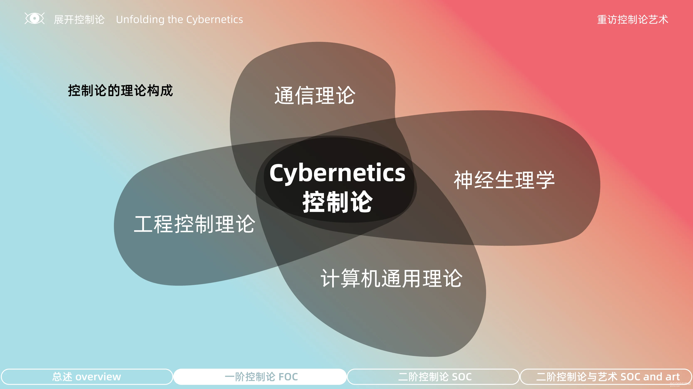
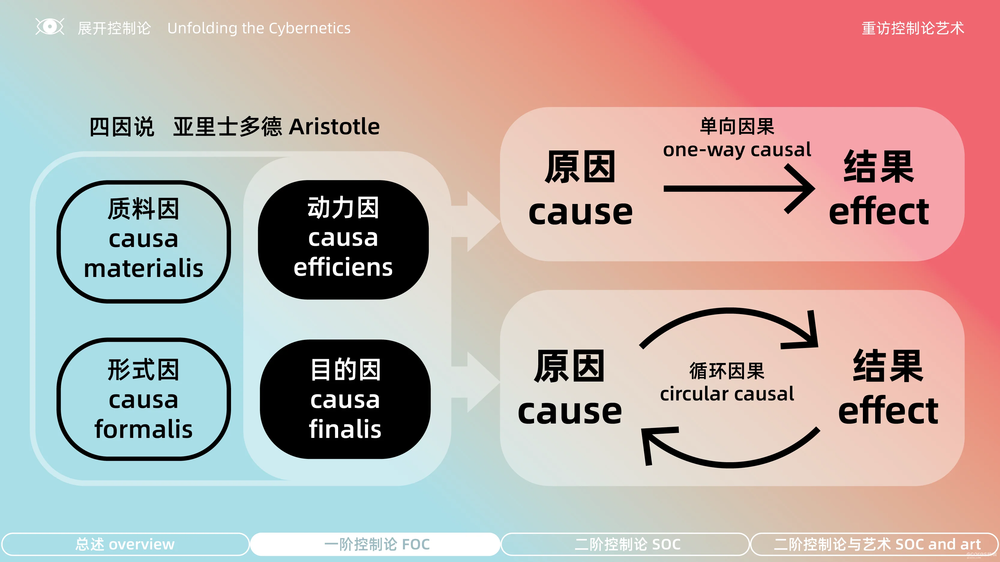
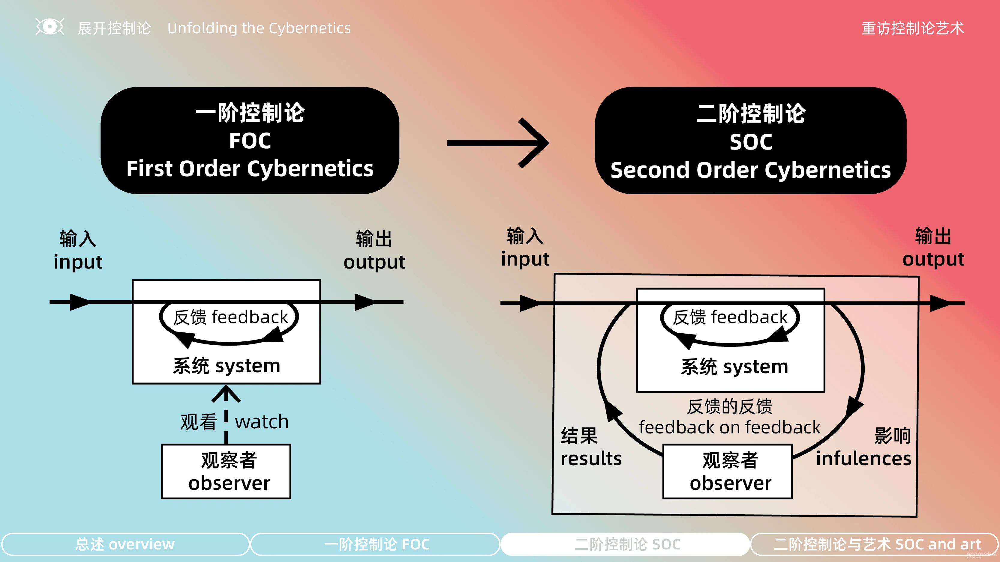

# Concepts

## 意识形态

每个社会都有意识形态，作为形成“大众想法”或共识的基础，而社会中大多数的人通常都看不见它。占有优势地位的意识形态以一种“中立”的姿态呈现，而所有其他与这个标准不同的意识形态则常常被视为极端，不论到底真实的情况为何。哲学家福柯就曾经写过关于意识形态中立性的这种观念。

卡尔·马克思所理解的意识形态是一种不平等的权力关系，是统治阶级为了欺骗和使权力关系具有合法性的产物，目的是为了让大家扭曲对于现实的认识，马克思也称其为上层建筑。通常是某些社会的道德价值观形塑了意识形态的基础。

## 信息论
### 信息噪音
信息论的创始人香农(C·E·Shannon)从工程技术的角度出发，提出了信息传播中的“噪音”概念，即指由于技术故障或技术不完善造成的干扰并使得发出信号与接受信号之间出现的信息失真。

### 信息熵（Information Entropy）

在信息论里面，熵是对不确定性的测量。但是在信息世界，熵越高，则能传输越多的信息，熵越低，则意味着传输的信息越少。
  - 一条消息的信息熵越高，其信息量越大。
  - 一种语言的文本数据流，其熵越低越易懂，因为好预测。

## 控制论
控制论（英語：cybernetics）是探索调节系统的跨学科研究， 它用于研究控制系统的结构、局限和发展。这一论说的提出者，美國電子工程專家诺伯特·维纳在1948年将控制论定义为“以机器中的控制与调节原理、以及将其类比到生物体或社会组织体后的控制原理为对象的科学研究。”  换句话说，这是关于人、动物和机器如何相互控制和通信的科学研究。

> 在维纳的理论中，控制论系统通过各个组成部分的信息交换和反馈，不断调整自身的运行方式，完成系统的自我调节和自我控制，从而形成无需外部规划和干预的自发秩序。在维纳看来，这样的原理不仅存在于防空导弹系统中，而应该构成一种万事万物的自然法则：如果将人类社会、生物体和自动化机器都看作一个控制系统，那么它们就不存在本质区别。也就是说，一旦达成了自我调节，人类社会也一样会出现自动化系统般的和谐、平等和民主的秩序，成为一个生生不息的去中心化系统。

> 控制论与自由主义相反，其认为生物的、物理的和社会的行为都是整体编码的，也可以被解码。更准确地说，其认为每个个体的行为都是“被引导的”，而归根结底，是出于“系统”的生存需要才使得这一点成为可能，个体也必须对“系统”做出贡献。

### 梅西会议（Macy Conference）
由来自不同学科 举行的 在纽约 的指导下 弗兰克·弗里蒙特-史密斯 的学者在 小乔赛亚·梅西基金会的 于 1941 年开始至 1960 年 有意义的交流 这些会议的明确目标是促进跨科学学科的 ， 并恢复科学的统一。

控制论会议于 1946 年至 1953 年间举行，由 Josiah Macy, Jr. 基金会 组织，并受到 Lawrence K. Frank 和 Frank Fremont-Smith的推动。 该基金会的作为这组会议的主席， 沃伦·麦卡洛克 有责任确保学科界限不被过度尊重。 [12] [13] 由于将梅西会议中最多样化的参与者聚集在一起，控制论特别复杂，因此它们是最难组织和维护的。

### 行为、目的和目的论
首先要说明「目的论」（teleology）这个概念，借用自亚里士多德的「四因说」中的「目的因」。其中包括质料因（causa materialis ）/形式因（causa formalis ）/目的因（causa finalis ）/动力因（causa efficiens），其中与时间有关的是后两种：动力因和目的因。

动力因我们再熟悉不过了，就是常见的因果关系，这是经典科学观比较容易接受的一种逻辑关系。如果用我们观看今天活动的观众来举例就是：因为你们打开了智能设备，所以此时你们在观看这场分享。

但是用目的论的角度来看则是：你们为了（in order to）能看到这场分享，而打开了智能设备，这让你们最终看到了这场分享。这就是说是未来会发生的事情决定了当下的行动。这是一种非常激进的因果循环论，也是当时的哲学届和科学届所不能接受的。

### 一阶和二阶控制论
二阶控制论中的观察者则是反馈循环中的参与者，他自己的观察和行为都会对系统产生影响，甚至可能牵一发而动全身。因此二阶控制论不仅强调对系统的观察和影响，而且还注重观察者对自身的反思，例如上边提到的两条线索都是对人类认知方式的反思。

### 自创生（Autopoiesis）
自创生（Autopoiesis）一词源于希腊语，意为“自我创造”或“自我生产”。自创生理论描述了一个系统如何通过自身的组织和过程来维持和再生产自身。具体来说，一个自创生系统具有以下特征：

- 自我界定：系统通过其组织结构定义自身的边界，并将自身与环境区分开来。
- 自我维持：系统通过内部过程维持其结构和功能，确保系统的持续存在。
- 自我再生产：系统能够再生产其组成部分，从而维持其整体组织。

## 赛博格

赛博格（英语：Cyborg），又称“生化人”或“半机器人”，是控制论有机体的简称，是有机体与生物机电一体化（Biomechatronic）的生物，又称“人机融合”。该词最早由曼菲德·克莱恩斯和内森·克莱恩于1960年创造。不同于仿生学、生物机器人或仿生人，赛博格是以无机物所构成的人造物，植入或者装配在有机体身体内外，但思考动作均借由有机体生物控制。通常这样做的目的是借由人工科技来增加或强化生物体的能力。 

## 新自由主义

### 古典自由主义
古典自由主义（英语：classical liberalism）是一种支持个人先于国家存在的政治哲学，强调个人的权利、私有财产，认为政府存在的目的仅在于保护每个个体的自由。古典自由主义发源于17世纪和18世纪，通常被视为由于工业革命和随后的资本主义体制而产生的一种意识形态。言论自由、信仰自由、思想自由、自我负责，和自由市场等概念最先也是由古典自由主义所提出，后来才陆续被其他政治意识形态所采纳。古典自由主义反对当时绝大多数较早期的政治学说，例如君权神授说、世袭制度和国教制度，强调个人的自由、理性。美国革命和法国大革命都受到古典自由主义的影响。

古典自由主义认为一国的真正财富不是金银总量的增加，而是其国民创造的商品服务的数量。政府的干预经常是阻碍了经济的增长，因此主张将政府排除出经济领域，让经济生活自行其事，让追求自身利益的无数的个体理性的计算来引导经济生活的调整，即“社会应当尽量从政府干预中摆脱出来，尽量的自由”，“管得最少的政府是最好的政府”。

### 新自由主义内容

新自由主义（英语：Neo-liberalism）是经济自由主义在二十世纪末的一种复苏形式，从1970年代以来在国际经济决策中的角色变得愈来愈重要。新自由主义的核心是自由的金融市场和自由的资金融通，这种意识型态强调金融市场在储蓄配置方面上的有效作用，并且主张在社会的各个方面上推动金融化进程、减弱甚至撤销对于金融机构的监管措施和实施有利于金融机构的发展的政策等等。

   - 鼓吹国家推动金融市场自由化进程的意识型态
   - 主张结合国内自由市场并以政治手段强迫打通国外市场的意识型态
   - 一种将市场视为人类道德观念的体现且与生产效率无关的意识型态
   - 一种把整个社会视为一个市场的意识型态
   - 主张完全由微观经济学来支配经济和排斥宏观经济学及其附属概念（如国家及社会的益处）的意识型态

### 朝圣山学会
( 朝圣山学会 MPS ) 成立于 1947 年，是一个由经济学家、哲学家、历史学家、知识分子和商界领袖组成的国际组织。 被描述为 新自由主义 它的意识形态取向 ，尽管一些学者声称它是古典自由主义的 。其总部位于 德克萨斯理工大学 的 德克萨斯州拉伯克市 。该协会倡导 言论自由 、 自由市场 的政治价值观 经济政策和开放社会 。 此外，该协会还寻求寻找私营部门取代目前由政府实体提供的许多职能的方法

> 成立后的几十年里 朝圣山学会 ，该学会的思想在很大程度上仍处于政治政策的边缘，仅限于一些智囊团和大学。 也只取得了有限的成功 秩序自由主义者 的 德国 ，他们认为国家在经济中需要强大的影响力。 直到 20 世纪 70 年代一系列经济衰退和危机之后，新自由主义政策建议才得到广泛实施。 此时，新自由主义思想已经发展。 的早期新自由主义思想 朝圣山学会 经济学之间找到一条中间道路 试图在大萧条 后加强政府干预的趋势与 自由放任 社会中许多人认为造成大萧条的 。 米尔顿·弗里德曼（Milton Friedman） 在其早期论文《新自由主义及其前景》中写道：“新自由主义将接受十九世纪自由主义对个人根本重要性的强调，但它将取代十九世纪 自由放任 的目标作为实现这一目标的手段，竞争秩序的目标”需要有限的国家干预，以“监管体系、创造有利于竞争的条件和 防止垄断 ，提供稳定的 货币框架 ，并缓解严重的痛苦和困扰。” 到了 20 世纪 70 年代，新自由主义思想（包括弗里德曼的思想）几乎完全关注 市场自由化 ，并坚决反对几乎所有形式的国家干预经济。 

### 哈耶克

哈耶克认为 自由价格体系 不是一种有意识的发明（由人类有意设计的），而是 自发秩序 ，或者苏格兰哲学家 亚当·弗格森 所说的“人类行为的结果，而不是人类设计的结果”。 例如，哈耶克将价格机制与语言放在同一水平上，这是他在价格信号理论中发展起来的。 
中将文明的诞生归因于 私有财产。 哈耶克在他的著作 《致命的自负》 （1988） 他解释说， 价格信号 是使每个经济决策者能够 交流隐性知识 或 分散知识以解决经济计算问题的唯一手段。 相互 阿兰·德·贝努瓦 右派》的 《新 论》杂志上发表了一篇对哈耶克著作的高度批评的文章 在《目的 意识形态的独裁和极权主义含义 ，引用了哈耶克“自发秩序”思想背后的错误假设以及他的自由市场 。 
哈耶克将市场视为自发秩序的概念已应用于生态系统，以捍卫广泛的不干预政策。 与市场一样，生态系统包含复杂的信息网络，涉及持续的动态过程，包含订单中的订单，整个系统的运行无需有意识的指导。 根据这一分析，物种取代了价格，成为由一组复杂的很大程度上不可知的元素组成的系统中的可见元素。 人类对生态系统中有机体之间无数相互作用的无知限制了我们操纵自然的能力。 
哈耶克的价格信号概念与消费者常常不知道改变市场的特定事件有关，但仅仅因为价格上涨就改变了他们的决定。 因此，定价传达信息。 

### 兴起

在第二次世界大战后新自由主义的发展一直相当缓慢，直到1970年代才开始更快速的增长，不过新自由主义也非都是通过和平的方式来被奉行。一个经常被举出来的纽自由主义（Neoliberalism）的成功例子是奥古斯托·皮诺切特统治下的智利，皮诺切特是透过暴力推翻了民选的萨尔瓦多·阿连德才掌权的。阿连德政府采用激进的左翼政策，被不少人称为国有社会主义政策。在皮诺切特上台后，他起用了一批受到米尔顿·弗里德曼影响的芝加哥派经济学家，迅速转向纽自由主义，大量民营化国有的资产（但一些公司仍因裙带关系而得到国家的优厚待遇）。这些政策后来被《布雷顿森林协议》的制定者模仿，在许多贫穷国家被实行，尤其是在拉丁美洲国家。

这一波自由市场资本主义的崛起在美国的里根和英国的撒切尔时期达到最高潮，里根和撒切尔政府不只将他们国家的政策转向自由放任主义的一边，同时也运用布雷顿森林协定向全世界其他国家施加他们的政策。也因此，一些人视新自由主义为“华盛顿共识”的同义词，华盛顿共识本身便是国际货币基金和世界银行在20世纪末和21世纪初的主要政治观点。新自由主义者的一句格言（如同撒切尔所说的）是：“除了通往全球化资本主义外‘没有其他任何选择’存在。”

在1980年代晚期和1990年代初期，新自由主义的政策也被传统上位居中间偏右的政党所采纳，美国的民主党在1990年代大幅采用新自由主义的政策，总统比尔·克林顿也支持北美自由贸易协议，并将自由贸易作为他的经济政策所不可或缺的一部分，提倡科技知识产权以作为美国减少贸易逆差的方式。一些中间偏左的新自由主义经济学家认为贸易保护主义与左翼右翼无关，而是和“不对称”的问题有关。许多第三种道路的政党—包括英国的工党和德国的社会民主党都采纳了新自由主义的政策。这些延续了1980年代政策的政府主张他们可以运用这样的方式来达成更大的社会利益，并且利用经济捆绑的方式来使那些刚脱离斯大林主义制度的欧洲国家能更快融入世界经济的行列。

### 福特制

福特制是“一个同名的生产系统，其设计是生产出大量标准化且廉价的产品，并提供其工人体面足够的工资来买这些产品”。福特制也被描述为“一个基于大量生产的经济扩张和技术进步的模式，大量生产是利用专用机器和非熟练工人生产大批量的标准化产品”。尽管福特制是一套在汽车工业用来提高生产率的方法，但这个原则能够运用到任何一种制造程序中。其成功之处来源于三个主要原则：

  - 产品的标准化（非手工制作：一切都是由非熟练工人利用机器和模子来制作的）
  - 生产流水线的采用，利用专用工具和设备让非熟练工人能合作生产成品
  - 付给工人高于一般生活开销的工薪，以便让他们有能力来买他们自己制造的产品。

## 压抑性去升华

压抑性去升华 （英语： repressive desublimation ）为 德裔美国 哲学家 兼 社会学家 赫伯特·马尔库塞 于其1964年出版的著作《 单向度的人 》中所提出的概念，意指 资本主义 发达工业社会中，技术理性的进步是如何消解了高等文化中的对立和超越因素。另而言之，尽管艺术在过去被用于表达「不现实的东西」同「现实的东西」的合理对立，资本主义社会将艺术贬值为商品，并将之整合至社会当中。 就如同作者于书中指出：「灵魂的音乐也是推销商品的音乐。」

马尔库塞认为，当肤浅、直接性的满足取代了深层的、间接性的满足，压抑性去升华成功削弱了人们批判社会的精力，并以自由的表象实现社会控制的目的。 

# Related People
- 马尔库塞
- 让·鲍德里亚
- 拉康
- 福柯

# Links

[压抑性去升华](https://zh.wikipedia.org/wiki/%E5%A3%93%E6%8A%91%E6%80%A7%E5%8E%BB%E6%98%87%E8%8F%AF)

[第一章　新的控制形式](https://www.marxists.org/chinese/marcuse/marxist.org-chinese-marcuse-1964-3.htm)

[第三章　对痛苦意识的征服：压抑性贬黜](https://www.marxists.org/chinese/marcuse/marxist.org-chinese-marcuse-1964-5.htm)

[第三章身份：自我的符号化](docs/第三章身份：自我的符号化.md)

[拉康学习笔记：如何理解 “人的欲望就是他者的欲望”？](https://zhuanlan.zhihu.com/p/409614258)

[拉康的欲望（一）·源于缺乏](https://zhuanlan.zhihu.com/p/129262021)

[拉康精神分析术语解释：符号界、阉割、想象界](https://zhuanlan.zhihu.com/p/351576528)

[精神分析里的死本能（攻击驱力）是什么?具体表现在那些地方?](https://www.zhihu.com/question/24064732?utm_id=0)

[《启蒙辩证法》对工具理性的批判与反思》](https://www.hanspub.org/journal/PaperInformation?paperID=50117)
